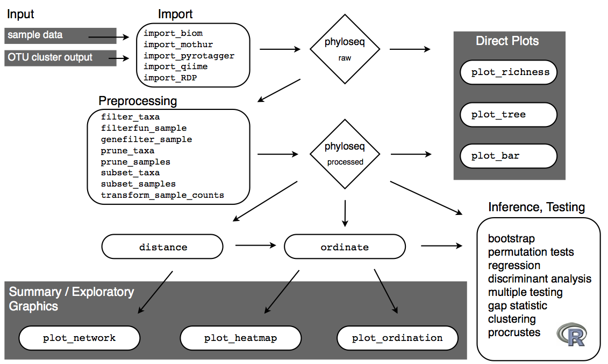
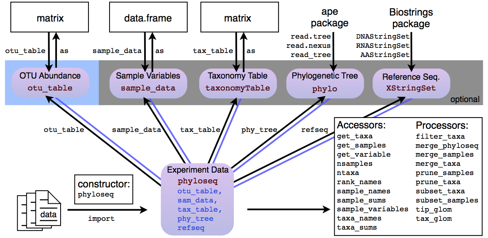

```{r, include=FALSE}
knitr::opts_chunk$set(echo = TRUE)
```


# Outline

- Introductions, expectations.
- **Poll**: Familiarity with R, RStudio, dada2, phyloseq?
- Installation check: Are we all ready?
- Definitions: R, RStudio, R markdown
- R language: objects (nouns), R functions (verbs)
- Plotting stuff (ggplot2) -- R visualizations
- Working with tables of data via the "Tidyverse"
- Importing data into R
- Intro to phyloseq

&nbsp;

&nbsp;

&nbsp;

&nbsp;

&nbsp;

&nbsp;

&nbsp;

&nbsp;

&nbsp;

&nbsp;


# Recommended Resources

## For R

- [RStudio Online Learning](https://www.rstudio.com/online-learning/)
- [R for Data Science](http://r4ds.had.co.nz/) -- free online book!
- [Cheat Sheets!](https://www.rstudio.com/resources/cheatsheets/)

## For phyloseq, dada2

- [Bioconductor home](http://bioconductor.org/)
- [DADA2 home](http://benjjneb.github.io/dada2/)
- [phyloseq home](https://joey711.github.io/phyloseq/)


## Prerequisites

This section focusses on ggplot2, one of the core members of the tidyverse. 
To access the datasets, help pages, and functions 
that we will use in this section, 
load the tidyverse by running this code:

```{r}
library(tidyverse)
```

That one line of code loads all of the core packages
in the "tidyverse" -- a collection of R packages
that make data operations better and more consistent.
 
If you run this code and get the error message 
"there is no package called ‘tidyverse’", 
you'll need to first install it, then run `library()` once again.

```{r eval = FALSE}
install.packages("tidyverse")
library(tidyverse)
# Set ggplot2 theme now
theme_set(theme_bw())
```

You only need to install a package once, 
but you need to reload it every time you start a new R session.


&nbsp;

&nbsp;

&nbsp;

&nbsp;

&nbsp;

&nbsp;

&nbsp;

&nbsp;

&nbsp;

&nbsp;


# Definitions

## R -- A language

R is a programming language.
From inception, it was designed for

- statistical computing
- interaction with data

*Interactive first* is somewhat unusual among programming languages.
It makes R especially well-suited for scientific computing,
where the goals are to explore and understand new data.
The statistical bent is also helpful, 
because a lot of scientific questions 
eventually become statistical analyses of a form or fashion.

**R** and most extensions/libraries 
are aggressively free and open-source.
We will benefit from this freeness and openness in this course.

https://www.r-project.org/


&nbsp;

&nbsp;

&nbsp;

&nbsp;

&nbsp;

&nbsp;

&nbsp;

&nbsp;

&nbsp;

&nbsp;


## RStudio IDE

*interactive*... Joey jump through helpful tips around RStudio IDE.

- [RStudio Home](https://www.rstudio.com/)
- [RStudio IDE Cheat Sheet](https://github.com/rstudio/cheatsheets/raw/master/rstudio-ide.pdf)
- Important Panels (text editor, console, plot/viewer, help)
- Session (Working directory, terminate R, restart R, etc.)
- Key-bindings (short-cuts: comment, run-chunk, indent, pipe, assign)


&nbsp;

&nbsp;

&nbsp;

&nbsp;

&nbsp;

&nbsp;

&nbsp;

&nbsp;

&nbsp;

&nbsp;


## R Markdown

This file that you're looking at
(or the HTML that was rendered from it)
is an R Markdown document. 

Markdown is a simple formatting syntax for authoring 

- HTML, 
- PDF, 
- MS Word documents 
- (and many more). 

Markdown has become a popular standard for authoring text-oriented content,
because it is intended to be as easy-to-read and easy-to-write as is feasible.
For the most part, it is just a simple definition 
for how to mark-up plain text -- 
carefully chosen so that mark-ups look like what they mean --
and readable/writable as if you were 
reading/writing a plain-text (non-HTML) email.

Here are the most-common text formatting markups:

- *italics*
- **bold**
- [A link](https://daringfireball.net/projects/markdown/)

For more details, see

- [Rmarkdown RStudio Home](http://rmarkdown.rstudio.com)
- [R Markdown Cheat Sheet](https://github.com/rstudio/cheatsheets/raw/master/rmarkdown-2.0.pdf)

When you click the **Knit** button in RStudio IDE, 
a document will be generated that includes 
both content as well as the output of any embedded R code chunks 
within the document. You can embed an R code chunk like this:

```{r}
head(mpg)
summary(mpg)
```

## Code Chunks

That last bit was a "code chunk".
It consists of a *code fence* made of three back-ticks above and below
the code that you want to include.
For R code you also need to include the `{r}` on the top fence.

To save yourself from extra typing and mistakes, 
use the RStudio shortcut: 

CMD/CTRL + ALT + I

```{r}
# stuff here
```


Try it out now `:-)`


&nbsp;

&nbsp;

&nbsp;

&nbsp;

&nbsp;

&nbsp;

&nbsp;

&nbsp;

&nbsp;

&nbsp;


## R Objects

There are two main types of objects in R:

- data (think: "noun")
- functions (think: "verb")

(Yes, in R functions are also objects)

What distinguishes nouns from verbs?
**parentheses**.


&nbsp;

&nbsp;

&nbsp;

&nbsp;

&nbsp;

&nbsp;

&nbsp;

&nbsp;

&nbsp;

&nbsp;


## Inspecting data

- What type of data is this?
- How many elements? dimensions?

```{r}
head(mpg)
summary(mpg)
class(mpg)
dim(mpg)
```

If above isn't enough detail, try `str`:

```{r}
str(mpg)
```


&nbsp;

&nbsp;

&nbsp;

&nbsp;

&nbsp;

&nbsp;

&nbsp;

&nbsp;

&nbsp;

&nbsp;


## Inspecting functions

- Question: How do I know the arguments to this function?
- Answer: `?` (the help function)
- Usage: `?functionName`
- TAB: when inside a function's parenthesis, hit TAB. 
See/select parameter names and their description straight from the doc.

```{r, eval=FALSE}
?mean
```


&nbsp;

&nbsp;

&nbsp;

&nbsp;

&nbsp;

&nbsp;

&nbsp;

&nbsp;

&nbsp;

&nbsp;


&nbsp;

&nbsp;

&nbsp;

&nbsp;

&nbsp;

&nbsp;

&nbsp;

&nbsp;

&nbsp;

&nbsp;


# Data visualisation

*Let's jump right in!*
Rather than go through more description about R,
let's learn by doing (making plots).

(Adapted from 
[R for Data Science](http://r4ds.had.co.nz/data-visualisation.html))


&nbsp;

&nbsp;

&nbsp;

&nbsp;

&nbsp;

&nbsp;

&nbsp;

&nbsp;

&nbsp;

&nbsp;


## Introduction

> "The simple graph has brought more information to the data analyst’s mind 
> than any other device." --- John Tukey

This section will teach you how to visualise your data using ggplot2.
R has several systems for making graphs, 
but ggplot2 is one of the most elegant and most versatile. 
It is also the graphics tool used by phyloseq.

ggplot2 implements the __grammar of graphics__ ("gg"), 
a coherent philosophy/system for describing and building graphs. 
With ggplot2, you can do more faster by learning one system 
and applying it in many places.

If you'd like to learn more about the theoretical underpinnings of ggplot2 before you start,
try "The Layered Grammar of Graphics", <http://vita.had.co.nz/papers/layered-grammar.pdf>.


### The `mpg` data frame

Let's use our first graph to answer a question: 

> Do cars with big engines use more fuel than cars with small engines? 

You probably already have an answer, but try to make your answer precise. 

- What does the relationship between engine size and fuel efficiency look like? 
- positive? 
- Negative? 
- Linear? 
- Nonlinear?

You can test your answer with the `mpg` __data frame__ found in ggplot2 (aka  `ggplot2::mpg`). A data frame is a rectangular collection of variables (in the columns) and observations (in the rows). `mpg` contains observations collected by the US Environment Protection Agency on 38 models of car. 

```{r}
mpg
```

Among the variables in `mpg` are:

1. `displ`, a car's engine size, in litres.

1. `hwy`, a car's fuel efficiency on the highway, in miles per gallon (mpg). 
  A car with a low fuel efficiency consumes more fuel than a car with a high 
  fuel efficiency when they travel the same distance. 

To learn more about `mpg`, open its help page by running `?mpg`.


&nbsp;

&nbsp;

&nbsp;

&nbsp;

&nbsp;

&nbsp;

&nbsp;

&nbsp;

&nbsp;

&nbsp;


## Creating a ggplot

To plot `mpg`, run this code to put `displ` on the x-axis and `hwy` on the y-axis:

```{r}
ggplot(data = mpg) + 
  geom_point(mapping = aes(x = displ, y = hwy))
```

The plot shows a negative relationship between engine size (`displ`) and fuel efficiency (`hwy`). In other words, cars with big engines use more fuel. Does this confirm or refute your hypothesis about fuel efficiency and engine size?

With ggplot2, you begin a plot with the function `ggplot()`. `ggplot()` creates a coordinate system that you can add layers to. The first argument of `ggplot()` is the dataset to use in the graph. So `ggplot(data = mpg)` creates an empty graph, but it's not very interesting so I'm not going to show it here.

You complete your graph by adding one or more layers to `ggplot()`. The function `geom_point()` adds a layer of points to your plot, which creates a scatterplot. ggplot2 comes with many geom functions that each add a different type of layer to a plot. You'll learn a whole bunch of them throughout this section.

Each geom function in ggplot2 takes a `mapping` argument. This defines how variables in your dataset are mapped to visual properties. The `mapping` argument is always paired with `aes()`, and the `x` and `y` arguments of `aes()` specify which variables to map to the x and y axes. ggplot2 looks for the mapped variable in the `data` argument, in this case, `mpg`.

### A graphing template

Let's turn this code into a reusable template for making graphs with ggplot2. To make a graph, replace the bracketed sections in the code below with a dataset, a geom function, or a collection of mappings.

this doesn't run, just documentation...
```{r eval = FALSE}
ggplot(data = <DATA>) + 
  <GEOM_FUNCTION>(mapping = aes(<MAPPINGS>))
```

The rest of this section will show you how to complete and extend this template to make different types of graphs. We will begin with the `<MAPPINGS>` component.


&nbsp;

&nbsp;

&nbsp;

&nbsp;

&nbsp;

&nbsp;

&nbsp;

&nbsp;

&nbsp;

&nbsp;


## Exercises - ggplot, mpg

1.  Run `ggplot(data = mpg)`. What do you see?

```{r}
names(mpg)
ggplot(data = mpg) + 
  geom_point(mapping = aes(x = trans, y = cty))
```


1.  How many rows are in `mpg`? How many columns?

```{r}
nrow(mpg)
```


1.  What does the `drv` variable describe?  Read the help for `?mpg` to find
    out.

```{r}
?mpg
```

1.  Make a scatterplot of `hwy` vs `cyl`.

```{r}
ggplot(data = mpg, aes(cyl, hwy)) + geom_point()
```


1.  What happens if you make a scatterplot of `class` vs `drv`? Why is
    the plot not useful?


&nbsp;

&nbsp;

&nbsp;

&nbsp;

&nbsp;

&nbsp;

&nbsp;

&nbsp;

&nbsp;

&nbsp;


&nbsp;

&nbsp;

&nbsp;

&nbsp;

&nbsp;

&nbsp;

&nbsp;

&nbsp;

&nbsp;

&nbsp;


## Aesthetic mappings

> "The greatest value of a picture is when it forces us to notice what we
> never expected to see." --- John Tukey

In the plot below, one group of points (highlighted in red) seems to fall outside of the linear trend. These cars have a higher mileage than you might expect. How can you explain these cars? 

```{r, echo = FALSE}
ggplot(data = mpg, mapping = aes(x = displ, y = hwy)) +
  geom_point() + 
  geom_point(
    data = dplyr::filter(mpg, displ > 5, hwy > 20), 
    colour = "red", size = 2.2)
```

You can convey information about your data by mapping the aesthetics in your plot to the variables in your dataset. For example, you can map the colors of your points to the `class` variable to reveal the class of each car.

```{r}
ggplot(data = mpg) + 
  geom_point(
    mapping = aes(
      x = displ, 
      y = hwy, 
      color = class))
```

To map an aesthetic to a variable, associate the name of the aesthetic to the name of the variable inside `aes()`. 

The colors reveal that many of the unusual points are two-seater cars. 

In the above example, we mapped the variable, `class`, to the color aesthetic, but we could have mapped `class` to other aesthetics in the same way. 

Once you map an aesthetic, ggplot2 takes care of the rest. 


&nbsp;

&nbsp;

&nbsp;

&nbsp;

&nbsp;

&nbsp;

&nbsp;

&nbsp;

&nbsp;

&nbsp;


## Exercises - aesthetic mapping

1.  What function defines the aesthetic-mapping for a plot or layer?

```{r}
aes()
```

1.  What are the possible arguments besides `x` and `y`? (Hint: `aes` is a function)

```{r}
aes(color = var1, shape = var2, size, alpha, fill)
```


1.  What's gone wrong with this code? Why are the points not blue?

    ```{r}
    ggplot(data = mpg) + 
      geom_point(mapping = aes(x = displ, y = hwy), color = "blue")
    ```
    
1.  Which variables in `mpg` are categorical? Which variables are continuous? 
    (Hint: type `?mpg` to read the documentation for the dataset). How
    can you see this information when you run `mpg`?
    
```{r}
mpg
```
    

1.  Map a continuous variable to `color`, `size`, and `shape`. How do
    these aesthetics behave differently for categorical vs. continuous
    variables? 
    
```{r}
ggplot(mpg) +
  geom_point(aes(x = manufacturer, y = cty, color = hwy))
```
    
    
1.  What happens if you map the same variable to multiple aesthetics? 

```{r}
ggplot(mpg) +
  geom_point(aes(x = manufacturer, y = cty, color = cty))
```


1.  What does the `stroke` aesthetic do? What shapes does it work with?
    (Hint: use `?geom_point`)
    
```{r}
ggplot(mpg) +
  geom_point(aes(x = manufacturer, y = cty, stroke = hwy))
```
    
    
1.  BONUS - What happens if you map an aesthetic to something other than a variable 
    name, like `aes(colour = displ < 5)`?  
    
```{r}
ggplot(mpg) +
  geom_point(aes(
    x = manufacturer, 
    y = cty, 
    color = log10(displ)))
```
    


&nbsp;

&nbsp;

&nbsp;

&nbsp;

&nbsp;

&nbsp;

&nbsp;

&nbsp;

&nbsp;

&nbsp;


## Common problems

As you start to run R code, you're likely to run into problems. Don't worry --- it happens to everyone. I have been writing R code for years, and every day I still write code that doesn't work.
This is where the interactivity of R really helps.

> Testing is like voting; do it early and often.
> --Joey

- Test parts of the code to make sure they result in what you expected.
- Test changes to the whole chunk until it works.
- You will eventually develop intuition for how R works
- Testing is also *experiential learning*, a great way to learn any programming language
- Carefully read error messages. They are often (but not always) helpful.
- Google the error message. You are probably not the first person to encounter your error. Online forums are rich and extremely useful.

One common problem when creating ggplot2 graphics is to put the `+` in the wrong place: it has to come at the end of the line, not the start. In other words, make sure you haven't accidentally written code like this:

```R
ggplot(data = mpg) 
+ geom_point(mapping = aes(x = displ, y = hwy))
```

```{r}
ggplot(data = mpg) +
  geom_point(mapping = aes(x = displ, y = hwy))
```


&nbsp;

&nbsp;

&nbsp;

&nbsp;

&nbsp;

&nbsp;

&nbsp;

&nbsp;

&nbsp;

&nbsp;


## Facets

One way to add additional variables is with aesthetics. Another way, particularly useful for categorical variables, is to split your plot into __facets__, subplots that each display one subset of the data. 

To facet your plot by a single variable, use `facet_wrap()`. The first argument of `facet_wrap()` should be a formula, which you create with `~` followed by a variable name (here "formula" is the name of a data structure in R, not a synonym for "equation"). The variable that you pass to `facet_wrap()` should be discrete. 

```{r}
ggplot(data = mpg) + 
  geom_point(mapping = aes(x = displ, y = hwy)) + 
  facet_wrap(~ class, nrow = 2)
```

To facet your plot on the combination of two variables, add `facet_grid()` to your plot call. The first argument of `facet_grid()` is also a formula. This time the formula should contain two variable names separated by a `~`. 

```{r}
ggplot(data = mpg) + 
  geom_point(mapping = aes(x = displ, y = hwy)) + 
  facet_grid(drv ~ cyl)
```

If you prefer to not facet in the rows or columns dimension, use a `.` instead of a variable name, e.g. `+ facet_grid(. ~ cyl)`.

### Exercises - facets

1.  What happens if you facet on a continuous variable?

1.  What do the empty cells in plot with `facet_grid(drv ~ cyl)` mean?
    How do they relate to this plot?
    
    ```{r, eval = FALSE}
    ggplot(data = mpg) + 
      geom_point(mapping = aes(x = drv, y = cyl))
    ```

1.  What plots does the following code make? What does `.` do?

    ```{r eval = FALSE}
    ggplot(data = mpg) + 
      geom_point(mapping = aes(x = displ, y = hwy)) +
      facet_grid(drv ~ .)
    
    ggplot(data = mpg) + 
      geom_point(mapping = aes(x = displ, y = hwy)) +
      facet_grid(. ~ cyl)
    ```

1.  Take the first faceted plot in this section:

    ```{r, eval = FALSE}
    ggplot(data = mpg) + 
      geom_point(mapping = aes(x = displ, y = hwy)) + 
      facet_wrap(~ class, nrow = 2)
    ```
    
    What are the advantages to using faceting instead of the colour aesthetic?
    What are the disadvantages? How might the balance change if you had a 
    larger dataset?
    
1.  Read `?facet_wrap`. What does `nrow` do? What does `ncol` do? What other
    options control the layout of the individual panels? Why doesn't
    `facet_grid()` have `nrow` and `ncol` argument?

1.  When using `facet_grid()` you should usually put the variable with more
    unique levels in the columns. Why?


&nbsp;

&nbsp;

&nbsp;

&nbsp;

&nbsp;

&nbsp;

&nbsp;

&nbsp;

&nbsp;

&nbsp;


## Geometric objects (geoms)

How are these two plots similar? 

```{r echo = FALSE, out.width = "50%", fig.align="default", message = FALSE}
ggplot(data = mpg) + 
  geom_point(mapping = aes(x = displ, y = hwy))

ggplot(data = mpg) + 
  geom_smooth(mapping = aes(x = displ, y = hwy))
```

Both plots contain the same x variable, the same y variable, and both describe the same data. But the plots are not identical. Each plot uses a different visual object to represent the data. In ggplot2 syntax, we say that they use different __geoms__.

A __geom__ is the geometrical object that a plot uses to represent data. People often describe plots by the type of geom that the plot uses. For example, bar charts use bar geoms, line charts use line geoms, boxplots use boxplot geoms, and so on. Scatterplots break the trend; they use the point geom. As we see above, you can use different geoms to plot the same data. The plot on the left uses the point geom, and the plot on the right uses the smooth geom, a smooth line fitted to the data. 

To change the geom in your plot, change the geom function that you add to `ggplot()`. For instance, to make the plots above, you can use this code:

```{r eval = FALSE}
# left
ggplot(data = mpg) + 
  geom_point(mapping = aes(x = displ, y = hwy))

# right
ggplot(data = mpg) + 
  geom_smooth(mapping = aes(x = displ, y = hwy))
```

Every geom function in ggplot2 takes a `mapping` argument. However, not every aesthetic works with every geom. You could set the shape of a point, but you couldn't set the "shape" of a line. On the other hand, you _could_ set the linetype of a line. `geom_smooth()` will draw a different line, with a different linetype, for each unique value of the variable that you map to linetype.

```{r message = FALSE}
ggplot(data = mpg) + 
  geom_smooth(mapping = aes(x = displ, y = hwy, linetype = drv))
```

Here `geom_smooth()` separates the cars into three lines based on their `drv` value, which describes a car's drivetrain. One line describes all of the points with a `4` value, one line describes all of the points with an `f` value, and one line describes all of the points with an `r` value. Here, `4` stands for four-wheel drive, `f` for front-wheel drive, and `r` for rear-wheel drive.

If this sounds strange, we can make it more clear by overlaying the lines on top of the raw data and then coloring everything according to `drv`. 

```{r echo = FALSE, message = FALSE}
ggplot(data = mpg, mapping = aes(x = displ, y = hwy, color = drv)) + 
  geom_point() +
  geom_smooth(mapping = aes(linetype = drv))
```

Notice that this plot contains two geoms in the same graph!

ggplot2 provides over 30 geoms, and extension packages provide even more (see <https://www.ggplot2-exts.org> for a sampling). 

- [ggplot2 live doc](http://docs.ggplot2.org/current/)
- [ggplot2 cheat sheet](https://github.com/rstudio/cheatsheets/raw/master/data-visualization-2.1.pdf)

Many geoms, like `geom_smooth()`, use a single geometric object to display multiple rows of data. For these geoms, you can set the `group` aesthetic to a categorical variable to draw multiple objects. ggplot2 will draw a separate object for each unique value of the grouping variable. In practice, ggplot2 will automatically group the data for these geoms whenever you map an aesthetic to a discrete variable (as in the `linetype` example). It is convenient to rely on this feature because the group aesthetic by itself does not add a legend or distinguishing features to the geoms.

```{r, fig.width = 3, fig.align = 'default', out.width = "33%", message = FALSE}
ggplot(
  data = mpg,
  mapping = aes(x = displ, y = hwy, color = drv)
) +
  geom_point() +
  geom_smooth()
```

If you place mappings in a geom function, ggplot2 will treat them as local mappings for _for that layer only_. 
This makes it possible to display different aesthetics in different layers.

```{r, message = FALSE}
ggplot(data = mpg, mapping = aes(x = displ, y = hwy)) + 
  geom_point(mapping = aes(color = class)) + 
  geom_smooth()
```

You can use the same idea to specify different `data` for each layer. Here, our smooth line displays just a subset of the `mpg` dataset, the subcompact cars. The local data argument in `geom_smooth()` overrides the global data argument in `ggplot()` for that layer only.

```{r, message = FALSE}
ggplot(data = mpg, mapping = aes(x = displ, y = hwy, color = class)) + 
  geom_point() + 
  geom_smooth(data = filter(mpg, class == "subcompact"), se = FALSE)
```

(We'll learn how `filter()` later.)


&nbsp;

&nbsp;

&nbsp;

&nbsp;

&nbsp;

&nbsp;

&nbsp;

&nbsp;

&nbsp;

&nbsp;


### Exercises - geoms

1.  What geom would you use to draw a line chart? A boxplot? 
    A histogram? An area chart?

1.  Run this code in your head and predict what the output will look like.
    Then, run the code in R and check your predictions.
    
    ```{r, eval = FALSE}
    ggplot(data = mpg, mapping = aes(x = displ, y = hwy, color = drv)) + 
      geom_point() + 
      geom_smooth(se = FALSE)
    ```

1.  What does `show.legend = FALSE` do?  What happens if you remove it?  
    Why do you think I used it earlier in the section?

1.  What does the `se` argument to `geom_smooth()` do?

1.  Will these two graphs look different? Why/why not?

    ```{r, eval = FALSE}
    ggplot(data = mpg, mapping = aes(x = displ, y = hwy)) + 
      geom_point() + 
      geom_smooth()
    
    ggplot() + 
      geom_point(data = mpg, mapping = aes(x = displ, y = hwy)) + 
      geom_smooth(data = mpg, mapping = aes(x = displ, y = hwy))
    ```

1.  Recreate the R code necessary to generate the following graphs.
    
    ```{r echo = FALSE, fig.width = 3, out.width = "50%", fig.align = "default", message = FALSE}
    ggplot(data = mpg, mapping = aes(x = displ, y = hwy)) + 
      geom_point() + 
      geom_smooth(se = FALSE)
    ggplot(data = mpg, mapping = aes(x = displ, y = hwy)) + 
      geom_smooth(aes(group = drv), se = FALSE) +
      geom_point()
    ggplot(data = mpg, mapping = aes(x = displ, y = hwy, color = drv)) + 
      geom_point() + 
      geom_smooth(se = FALSE)
    ggplot(data = mpg, mapping = aes(x = displ, y = hwy)) + 
      geom_point(aes(color = drv)) + 
      geom_smooth(se = FALSE)
    ggplot(data = mpg, mapping = aes(x = displ, y = hwy)) + 
      geom_point(aes(color = drv)) +
      geom_smooth(aes(linetype = drv), se = FALSE)
    ggplot(data = mpg, mapping = aes(x = displ, y = hwy)) + 
      geom_point(size = 4, colour = "white") + 
      geom_point(aes(colour = drv))
    ```
    
1.  What is the problem with this plot? How could you improve it? (Hint: jitter)

    ```{r}
    ggplot(data = mpg, mapping = aes(x = cty, y = hwy)) + 
      geom_point()
    ```

1.  What parameters to `geom_jitter()` control the amount of jittering?

1.  Compare and contrast `geom_jitter()` with `geom_count()`.


&nbsp;

&nbsp;

&nbsp;

&nbsp;

&nbsp;

&nbsp;

&nbsp;

&nbsp;

&nbsp;

&nbsp;


## Statistical transformations 

Next, let's take a look at a bar chart. Bar charts seem simple, but they are interesting because they reveal something subtle about plots. Consider a basic bar chart, as drawn with `geom_bar()`. The following chart displays the total number of diamonds in the `diamonds` dataset, grouped by `cut`. The `diamonds` dataset comes in ggplot2 and contains information about ~54,000 diamonds, including the `price`, `carat`, `color`, `clarity`, and `cut` of each diamond. The chart shows that more diamonds are available with high quality cuts than with low quality cuts. 

```{r}
ggplot(data = diamonds) + 
  geom_bar(mapping = aes(x = cut))
```

On the x-axis, the chart displays `cut`, a variable from `diamonds`. On the y-axis, it displays count, but count is not a variable in `diamonds`! Where does count come from? Many graphs, like scatterplots, plot the raw values of your dataset. Other graphs, like bar charts, calculate new values to plot:

* bar charts, histograms, and frequency polygons bin your data 
  and then plot bin counts, the number of points that fall in each bin.

* smoothers fit a model to your data and then plot predictions from the
  model.

* boxplots compute a robust summary of the distribution and then display a 
  specially formatted box.
    
ggplot2 provides over 20 stats for you to use. Each stat is a function, so you can get help in the usual way, e.g. `?stat_bin`. To see a complete list of stats, try the ggplot2 cheatsheet.


&nbsp;

&nbsp;

&nbsp;

&nbsp;

&nbsp;

&nbsp;

&nbsp;

&nbsp;

&nbsp;

&nbsp;


### Exercises

1.  What is the default geom associated with `stat_summary()`? How could
    you rewrite the previous plot to use that geom function instead of the 
    stat function?

1.  What does `geom_col()` do? How is it different to `geom_bar()`?

1.  Most geoms and stats come in pairs that are almost always used in 
    concert. Read through the documentation and make a list of all the 
    pairs. What do they have in common?

1.  What variables does `stat_smooth()` compute? What parameters control
    its behaviour?

1.  In our proportion bar chart, we need to set `group = 1`. Why? In other
    words what is the problem with these two graphs?
    
    ```{r, eval = FALSE}
    ggplot(data = diamonds) + 
      geom_bar(mapping = aes(x = cut, y = ..prop..))
    ggplot(data = diamonds) + 
      geom_bar(mapping = aes(x = cut, fill = color, y = ..prop..))
    ```

1.  (Bonus) Turn a stacked bar chart into a pie chart using `coord_polar()`.

1.  (Bonus) Flip x and y axes using `coord_flip()`.


&nbsp;

&nbsp;

&nbsp;

&nbsp;

&nbsp;

&nbsp;

&nbsp;

&nbsp;

&nbsp;

&nbsp;


&nbsp;

&nbsp;

&nbsp;

&nbsp;

&nbsp;

&nbsp;

&nbsp;

&nbsp;

&nbsp;

&nbsp;


## Facets

A powerful feature of ggplot is it’s ability to ‘facet’ data by a categorical variable. 
There are many reasons to do this, 
but often this is better practice 
than alternative graphical representations 
[like stacked bar plots](https://github.com/joey711/phyloseq/issues/442).

Facets are a separate kind of ggplot layer

```{r}
pFacet <-
  ggplot(
    data = filter(mpg, class %in% c("compact", "pickup")), 
    mapping = aes(x = manufacturer, y=cty, col = trans)) + 
  geom_jitter(width = 0.1, alpha = 0.6) +
  coord_flip() +
  facet_grid(class ~ year)
pFacet
```

The `facet_grid` command instructed ggplot2 to make multiple mini plots -- 
"facets" -- according to categories in the data that we defined.

Faceting is used extensively in the phyloseq tutorial material.
See also `facet_wrap` for when you want 
multiple facet-rows on the same variable.


## Saving, exporting plots

All previous plotting examples rendered the graphic
in the default graphics viewer.
The very last example above went one step further 
and assigned the ggplot definition to a new object, 
called `pFacet`.

We can add further layers to this if we want 
(very useful for simplifying code)

```{r}
pFacet + 
  ggtitle("My multi-facet plot title.", "and subtitle.")
```

And we can also save this to a common graphics format 
in a file on your hard disk, using `ggsave()`.

```{r, eval=FALSE}
ggsave(
  filename = "pFacet.png", 
  plot = pFacet, 
  width = 6, 
  height = 7)
```


&nbsp;

&nbsp;

&nbsp;

&nbsp;

&nbsp;

&nbsp;

&nbsp;

&nbsp;

&nbsp;

&nbsp;


## bonus: UpSetR

> How not to use Venn diagrams. Ever.

Great for comparing sets of things.

```{r}
if(!require("UpSetR")){install.packages("UpSetR"); require("UpSetR")}
mpgClassList <-
  mpg %>% 
  group_by(class) %>% 
  do(manufacturer = unique(.$manufacturer))
mpgClassList
# Transform to list
mpgClassList <-
  mpgClassList$manufacturer %>% 
  set_names(mpgClassList$class)
mpgClassList
# Make Plot
mpgClassList %>% 
  fromList() %>% 
  upset(order.by = "freq")
```


&nbsp;

&nbsp;

&nbsp;

&nbsp;

&nbsp;

&nbsp;

&nbsp;

&nbsp;

&nbsp;

&nbsp;


&nbsp;

&nbsp;

&nbsp;

&nbsp;

&nbsp;

&nbsp;

&nbsp;

&nbsp;

&nbsp;

&nbsp;


# R Syntax and RStudio magic

(Borrowed from *R for Data Science*, 
[Chapter on "Workflow: basics"](http://r4ds.had.co.nz/workflow-basics.html))

You now have some experience running R code. 
I didn't give you many details, but you've figured out the basics. 
Frustration is natural when you start learning a new language. 
But while you should expect to be a little frustrated, 
take comfort in that it's both typical and temporary: 
it happens to everyone, and the only way to get over it is to keep trying.

Let's go through some more basics running R code, 
and that you know about some of the most helpful RStudio features.

We'll try out

- Tab completion
- frequent keybinding shortcuts
- variable assignment
- function arguments

## Coding basics

Let's review some basics we've so far omitted in the interests of getting you plotting as quickly as possible. 

**You can use R as a calculator**

```{r}
1 / 200 * 30
(59 + 73 + 2) / 3
sin(pi / 2)
```

You can create new objects with `<-` (or `=`):

```{r}
x <- 3 * 4
y = 1 + 5
```

All R statements where you create objects, __assignment__ statements, have the same form:

```{r eval = FALSE}
object_name <- value
```

When reading that code say "object name gets value" in your head.

Use RStudio's keyboard shortcut: Alt + - (the minus sign). 

`giveyoureyesabreak` and use spaces.


Object names must start with a letter, and can only contain letters, numbers, `_` and `.`. You want your object names to be descriptive, so you'll need a convention for multiple words. 

```{r, eval = FALSE}
i_use_snake_case
otherPeopleUseCamelCase
some.people.use.periods
And_aFew.People_RENOUNCEconvention
```

You can inspect an object by typing its name:

```{r}
x
```

Make another assignment:

```{r}
this_is_a_really_long_name <- 2.5
```

Try out RStudio's completion facility: type "this", press TAB, add characters until you have a unique prefix, then press return.

Make yet another assignment:

```{r}
r_rocks <- 2 ^ 3
```

Let's try to inspect it:

```{r, eval = FALSE}
r_rock
#> Error: object 'r_rock' not found
R_rocks
#> Error: object 'R_rocks' not found
```

Typos matter. Case matters.


## Calling functions

R has a large collection of built-in functions that are called like this:

```{r eval = FALSE}
function_name(arg1 = val1, arg2 = val2, ...)
```

Let's try using `seq()` which makes regular **seq**uences of numbers and, while we're at it, learn more helpful features of RStudio. 

Type `se` and hit TAB. 

A popup shows you possible completions. Specify `seq()` by typing more (a "q") to disambiguate, or by using ↑/↓ arrows to select. Notice the floating tooltip that pops up, reminding you of the function's arguments and purpose. If you want more help, press F1 to get all the details in the help tab in the lower right pane. 

Press TAB once more when you've selected the function you want. RStudio will add matching opening (`(`) and closing (`)`) parentheses for you. Type the arguments `1, 10` and hit return.

```{r}
seq(1, 10)
```

Type this code and notice you get similar assistance with the paired quotation marks:

```{r}
x <- "hello world"
```

Quotation marks and parentheses must always come in a pair. RStudio does its best to help you, but it's still possible to mess up and end up with a mismatch. If this happens, R will show you the continuation character "+":

```
> x <- "hello
+
```

The `+` tells you that R is waiting for more input; it doesn't think you're done yet. Usually that means you've forgotten either a `"` or a `)`. Either add the missing pair, or press ESCAPE to abort the expression and try again.

If you make an assignment, you don't get to see the value. You're then tempted to immediately double-check the result:

```{r}
y <- seq(1, 10, length.out = 5)
y
```

This common action can be shortened by surrounding the assignment with parentheses, which causes assignment and "print to screen" to happen.

```{r}
(y <- seq(1, 10, length.out = 5))
```

Now look at your environment in the upper right pane.
There you can see all of the objects that you've created.

## Exercises - R syntax

1.  Why does this code not work?

    ```{r, error = TRUE}
    my_variable <- 10
    my_varıable
    ```
    
    Look carefully! (This may seem like an exercise in pointlessness, but
    training your brain to notice even the tiniest difference will pay off
    when programming.)
    
1.  Tweak each of the following R commands so that they run correctly:

    ```{r, eval = FALSE}
    library(tidyverse)

    ggplot(dota = mpg) + 
      geom_point(mapping = aes(x = displ, y = hwy))
    
    fliter(mpg, cyl = 8)
    filter(diamond, carat > 3)
    ```
    
1.  Press Alt + Shift + K. What happens? How can you get to the same place
    using the menus?


&nbsp;

&nbsp;

&nbsp;

&nbsp;

&nbsp;

&nbsp;

&nbsp;

&nbsp;

&nbsp;

&nbsp;


&nbsp;

&nbsp;

&nbsp;

&nbsp;

&nbsp;

&nbsp;

&nbsp;

&nbsp;

&nbsp;

&nbsp;


# Tables in R

## Data frame summary

- `data.frame` - A table that holds data of different classes/types.
- There are some powerful extensions of this, especially `data.table::data.table` and `tibble::tibble`. The latter you will encounter in the tidyverse.
- `df[i, j]` - "Square bracket" notation works for both accession and assignment.
- `df[["column_name"]]` - double-bracket extracts/assigns columns.
- `df$column_name` - also extracts/assigns columns. *autocomplete* in RStudio.
- `df[i, ]` - extracts/assigns particular **row(s)**.
- `df[, j]` - extracts/assigns particular **columns(s)**.


## Subsetting

If you want to pull out a single variable, you need some new tools, `$` and `[[`. `[[` can extract by name or position; `$` only extracts by name but is a little less typing.

```{r}
# Define the number of rows for our simulated table
N = 50
df <- data.frame(
  x = runif(N),
  y = rnorm(N),
  group = sample(c("A", "B"), size = N, replace = TRUE)
)

df
```

Extract by name

```{r}
df$x
df[["x"]]
```

Extract by position

```{r}
df[[1]]
df[, 1]
df[1, ]
df[5, 2]
```


## Pipes!

Why pipe?

- *Convenience*. It can be really convenient to define multistep data manipulation
without having to create a new variable name for each step.
- *Legibility*. Multiple nested function calls get difficult to read.
Pipe syntax is more natural and simpler once you're used to it.

Pipe command: ` %>% `

RStudio quick command: `CMD + SHIFT + M`

The following are equivalent (use the same functions in the same way):

```{r}
# without pipe
nrow(filter(df, x > 0.2))
# with pipe
df %>% 
  filter(x > 0.2) %>% 
  nrow
```

To use the extractor functions from the previous chunk in a pipe, you'll need to use the special placeholder `.`:

```{r}
df %>% .$x
df %>% .[["x"]]
df %>% .[, "x"]
df %>% .[1:2, ]
```


## Evaluate by group

There are too many wonderful options for manipulating tables
in the tidyverse that we cannot cover them all. 
However, a few key functions are 
- `filter()`
- `group_by()`
- `summarize()`
- `arrange()`

Here is an example of such a multi-step table manipulation
that (in natural English):

> First filter the data frame `df` by values in `x`, 
then group by the categorical values in `group`,
then summarize the mean, maximum, and minimum of `y`.

```{r}
df %>% 
  filter(x > 0.2) %>% 
  group_by(group) %>% 
  summarize(meany = mean(y), maxy = max(y), miny = min(y))
```


## Exercises - Data Frames

1. What is the value in `df` at the third row and 1 column?
1. `df[5, 2]` is from which variable?
1. What is the median of `y` in `df`?
1. What is the median of `x` and `y` in group `A` and group `B`?
1. Create a plot that compares the distribution of values 
between groups A and B. Include a summarizing layer `geom_violin` or `geom_boxplot` and also show the points with `geom_jitter`.
1. BONUS: Repeat the previous exercise, but use 
the `geom_ridgeline()` layer from the "ggridges" package. 
(Hint: you might have to installe "ggridges" first.)
(Hint2: an example of the plot is shown below:)

```{r, echo=FALSE, eval=FALSE}
if(!require("ggridges")){install.packages("ggridges"); require("ggridges")}
ggplot(df, aes(x = y, y = group, color = group)) +
  geom_density_ridges2() +
  geom_jitter(width = 0, height = 0.1)
```


&nbsp;

&nbsp;

&nbsp;

&nbsp;

&nbsp;

&nbsp;

&nbsp;

&nbsp;

&nbsp;

&nbsp;


&nbsp;

&nbsp;

&nbsp;

&nbsp;

&nbsp;

&nbsp;

&nbsp;

&nbsp;

&nbsp;

&nbsp;


# Import data into R

R is oriented around doing everything in-memory (RAM).
It has its own representation of data objects,
and these are the objects that you're able 
to interact with during an R session.

> What if I want to read tabular data from a file on disk?

> What if I want to save data in R, for use later in R?


## Import R native format

- Write an R data frame to disk.
- Read the data frame from disk.
- Bonus: delete file on disk.

Write `df` to disk as "R Serialized Data", `.RDS`

```{r}
saveRDS(object = df, file = "df.RDS")
```

Read `"df.RDS"` from file on disk. Save as `dfNew`

```{r}
dfNew <- readRDS(file = "df.RDS")
identical(dfNew, df)
dfNew
```

**Bonus**: Remove file.

```{r}
file.remove("df.RDS")
```


## Import generic format(s)

(Adapted from *R for Data Science*, 
[Chapter on "Data Import"](http://r4ds.had.co.nz/data-import.html#data-import))

AKA: "file parsing". 

There are too many file formats in the world to try and cover in a short workshop.
Let's focus on a few key examples.

Here you'll learn how to read plain-text rectangular files into R. 
We'll only scratch the surface of data import, but many of the principles will translate to other forms of data. 
We'll finish with a few pointers to packages that are useful for other types of data.

### Prerequisites

In this section, you'll learn how to load flat files in R with the __readr__ package, which is part of the core tidyverse.

## Getting started

Most of readr's functions are concerned with turning flat files into data frames:

* `read_csv()` reads comma delimited files, `read_csv2()` reads semicolon
  separated files (common in countries where `,` is used as the decimal place),
  `read_tsv()` reads tab delimited files, and `read_delim()` reads in files
  with any delimiter.

* `read_fwf()` reads fixed width files. You can specify fields either by their
  widths with `fwf_widths()` or their position with `fwf_positions()`.
  `read_table()` reads a common variation of fixed width files where columns
  are separated by white space.

* `read_log()` reads Apache style log files. (But also check out
  [webreadr](https://github.com/Ironholds/webreadr) which is built on top
  of `read_log()` and provides many more helpful tools.)

These functions all have similar syntax: once you've mastered one, you can use the others with ease. For the rest of this section we'll focus on `read_csv()`. Not only are csv files one of the most common forms of data storage, but once you understand `read_csv()`, you can easily apply your knowledge to all the other functions in readr.

For the sake of demonstration, 
let's save our trusty `mpg` table to disk.

```{r}
write_csv(mpg, "mpg.csv")
```

Now let's read it back, and compare (as we did with "RDS" above).

```{r, message = TRUE}
mpg2 <- read_csv("mpg.csv")
mpg2
identical(mpg2, mpg)
```

When you run `read_csv()` it prints out a column specification that gives the name and type of each column.

Delete mpg.csv

```{r}
file.remove("mpg.csv")
```

You can also supply an inline csv file. This is useful for experimenting with readr and for creating reproducible examples to share with others:

```{r}
read_csv("a,b,c
1,2,3
4,5,6")
```

In both cases `read_csv()` uses the first line of the data for the column names, which is a very common convention. There are two cases where you might want to tweak this behaviour:

1.  Sometimes there are a few lines of metadata at the top of the file. You can
    use `skip = n` to skip the first `n` lines; or use `comment = "#"` to drop
    all lines that start with (e.g.) `#`.
    
    ```{r}
    read_csv("The first line of metadata
      The second line of metadata
      x,y,z
      1,2,3", skip = 2)
    
    read_csv("# A comment I want to skip
      x,y,z
      1,2,3", comment = "#")
    ```
    
1.  The data might not have column names. You can use `col_names = FALSE` to
    tell `read_csv()` not to treat the first row as headings, and instead
    label them sequentially from `X1` to `Xn`:
    
    ```{r}
    read_csv("1,2,3\n4,5,6", col_names = FALSE)
    ```
    
    (`"\n"` is a convenient shortcut for adding a new line. You'll learn more
    about it and other types of string escape in [string basics].)
    
    Alternatively you can pass `col_names` a character vector which will be
    used as the column names:
    
    ```{r}
    read_csv("1,2,3\n4,5,6", col_names = c("x", "y", "z"))
    ```

Another option that commonly needs tweaking is `na`: this specifies the value (or values) that are used to represent missing values in your file:

```{r}
read_csv("a,b,c\n1,2,.", na = ".")
```

This is all you need to know to read ~75% of CSV files that you'll encounter in practice. 

You can also easily adapt what you've learned to read tab separated files with `read_tsv()` and fixed width files with `read_fwf()`. 

To read in more challenging files, you'll need to learn more about how readr parses each column, turning them into R vectors.

### (Bonus) Compared to base R

If you've used R before, you might wonder why we're not using `read.csv()`. There are a few good reasons to favour readr functions over the base equivalents:

* They are typically much faster (~10x) than their base equivalents.
  Long running jobs have a progress bar, so you can see what's happening. 
  If you're looking for raw speed, try `data.table::fread()`. It doesn't fit 
  quite so well into the tidyverse, but it can be quite a bit faster.

* They produce tibbles, they don't convert character vectors to factors,
  use row names, or munge the column names. These are common sources of
  frustration with the base R functions.

* They are more reproducible. Base R functions inherit some behaviour from
  your operating system and environment variables, so import code that works 
  on your computer might not work on someone else's.


## Exercises - Import generic file formats

1.  What function would you use to read a file where fields were separated with  
    "|"?
    
1.  Apart from `file`, `skip`, and `comment`, what other arguments do
    `read_csv()` and `read_tsv()` have in common?
    
1.  What are the most important arguments to `read_fwf()`?
    
1.  Identify what is wrong with each of the following inline CSV files. 
    What happens when you run the code?
    
    ```{r, eval = FALSE}
    read_csv("a,b\n1,2,3\n4,5,6")
    read_csv("a,b,c\n1,2\n1,2,3,4")
    read_csv("a,b\n\"1")
    read_csv("a,b\n1,2\na,b")
    read_csv("a;b\n1;3")
    ```
    
1.  Why are `mpg` and `mpg2` not identical?


&nbsp;

&nbsp;

&nbsp;

&nbsp;

&nbsp;

&nbsp;

&nbsp;

&nbsp;

&nbsp;

&nbsp;


## (BONUS) Import other formats

To get other types of data into R, we recommend starting with the tidyverse packages listed below. They're certainly not perfect, but they are a good place to start. For rectangular data:

* __haven__ reads SPSS, Stata, and SAS files.

* __readxl__ reads excel files (both `.xls` and `.xlsx`).

* __DBI__, along with a database specific backend (e.g. __RMySQL__, 
  __RSQLite__, __RPostgreSQL__ etc) allows you to run SQL queries against a 
  database and return a data frame.

For hierarchical data: use __jsonlite__ (by Jeroen Ooms) for json, and __xml2__ for XML. Jenny Bryan has some excellent worked examples at <https://jennybc.github.io/purrr-tutorial/>.

For other file types, try the [R data import/export manual](https://cran.r-project.org/doc/manuals/r-release/R-data.html) and the [__rio__](https://github.com/leeper/rio) package.


&nbsp;

&nbsp;

&nbsp;

&nbsp;

&nbsp;

&nbsp;

&nbsp;

&nbsp;

&nbsp;

&nbsp;


&nbsp;

&nbsp;

&nbsp;

&nbsp;

&nbsp;

&nbsp;

&nbsp;

&nbsp;

&nbsp;

&nbsp;


# Introduction to phyloseq

The goal of the phyloseq package is to facilitate 
the kind of interactive, "not canned" workflow 
depicted in the graphic below.

The three main steps in phyloseq are:

- import data (produces phyloseq data object)
- filter and summarize data (agglomerate, ordinate)
- plot data

The phyloseq pacakge provides special functions 
for accomplishing this in a way that is 
consistent, reliable, low-error, and reproducible.




&nbsp;

&nbsp;

&nbsp;

&nbsp;

&nbsp;

&nbsp;

&nbsp;

&nbsp;

&nbsp;

&nbsp;


## A phyloseq object

A phyloseq object can contain multiple related tables, 
a tree, and even the sequence corresponding 
to each observation in the "OTU table".

A picture is maybe better than words, here:




&nbsp;

&nbsp;

&nbsp;

&nbsp;

&nbsp;

&nbsp;

&nbsp;

&nbsp;

&nbsp;

&nbsp;


## Import microbiome data

Key functions:

- `import_biom()` -- import biom-format file, return phyloseq data object
- `import_qiime()` -- same as above, legacy QIIME format
- `phyloseq()` -- takes R-encoded data types and returns phyloseq data object

The best reproducible examples on importing data with phyloseq 
can be found on the official data import tutorial page:

http://joey711.github.com/phyloseq/import-data

These function(s) take file pathnames as input, 
import and parse those files, 
and return a single "phyloseq" data object 
that contains all of the data. 


&nbsp;

&nbsp;

&nbsp;

&nbsp;

&nbsp;

&nbsp;

&nbsp;

&nbsp;

&nbsp;

&nbsp;


### Load *phyloseq*

To use *phyloseq* in a new R session, it will have to be loaded. This can be done in your package manager, or at the command line using the `library()` command:
```{r, message=FALSE, warning=FALSE}
library("phyloseq")
```


### Import from legacy QIIME

The phyloseq package comes with example legacy QIIME output files.
The way to find these files on your system is:

```{r}
otufile <- system.file("extdata", "GP_otu_table_rand_short.txt.gz", package="phyloseq")
otufile
mapfile <- system.file("extdata", "master_map.txt", package="phyloseq")
mapfile
trefile <- system.file("extdata", "GP_tree_rand_short.newick.gz", package="phyloseq")
trefile
```

Now use the `import_qiime` function to import the data 
from these three files, and generate a phyloseq object.

```{r}
gp = import_qiime(otufile, mapfile, trefile, verbose=FALSE)
class(gp)
```


## Exercise - import microbiome data

1. What are the components of the phyloseq object, `gp`?
```{r}
gp
```

1. How many taxa (OTUs) does it have?
```{r}
ntaxa(gp)
```


1. How many samples does it have?
26

1. How many variables are there in the sample data?
```{r}
sample_variables(gp)
gp %>% sample_data() %>% ncol
```


1. Import the OTU table encoded in "biom" format at the following path,
also included with phyloseq (hint: use `import_biom()`):
`biomFile <- system.file("extdata", "rich_dense_otu_table.biom", package="phyloseq")`

1. What are the answers to questions above about `gp`, but for this new data?
1. **BONUS** What is the total of all counts in each dataset?


&nbsp;

&nbsp;

&nbsp;

&nbsp;

&nbsp;

&nbsp;

&nbsp;

&nbsp;

&nbsp;

&nbsp;


## Filter

The following are key phyloseq functions for filtering/subsetting

- `prune_taxa`
- `prune_samples`
- `subset_taxa`
- `subset_samples`

`subset_taxa` and `subset_samples` are convenience wrapper around the `subset` function.
You can think of them as analogous to the `filter()` function in the tidyverse.
They support expressions of inclusion based on 
the `tax_table` or `sample_data`, respectively.

```{r}
# Only Firmicutes
subset_taxa(gp, Phylum == "Firmicutes")
# Only ocean samples
subset_samples(gp, SampleType=="Ocean")
```


`prune_taxa` and `prune_samples` are functions
for filtering based on an previously defined inclusion vector.
You can think of this as similar to square bracket notation 
on rows or columns of a table.

```{r}
# keep only taxa that were observed at least twice
prune_taxa(taxa_sums(gp) >= 2, gp)
# keep only samples with count greater than 2000
prune_samples(sample_sums(gp) >= 2000, gp)
```


&nbsp;

&nbsp;

&nbsp;

&nbsp;

&nbsp;

&nbsp;

&nbsp;

&nbsp;

&nbsp;

&nbsp;


## Exercise - phyloseq filter

1. How do you remove taxa that were only observed 1 time in the whole dataset?
```{r}
(taxa_sums(gp) > 1) %>% sum
```


1. **BONUS** - How do you filter to just taxa that appeared in more than one sample
(prevalence >= 2)?
```{r}
filter_taxa(gp, function(x){sum(x > 0) > 1}, prune = TRUE)
```

1. How do you remove samples that had less than 4500 reads (total count)?
```{r}
prune_samples(sample_sums(gp) > 4500, gp)
```

1. How do you filter to just samples that derive from the human body?
```{r}
# Which samples are human
sample_data(gp)[["SampleType"]] %in% c("Mock", "Skin", "Tongue", "Feces")
# get_variable(gp, "SampleType") %in% c("Mock", "Skin", "Tongue", "Feces")
humanSample = sample_data(gp)[["SampleType"]] %in% c("Mock", "Skin", "Tongue", "Feces")
prune_samples(samples = humanSample, gp)
```


&nbsp;

&nbsp;

&nbsp;

&nbsp;

&nbsp;

&nbsp;

&nbsp;

&nbsp;

&nbsp;

&nbsp;


## Aggregate observations

- `tax_glom()` -- Taxonomy-defined, taxonomy-aware agglomeration of observations.
- `tip_glom()` -- Tree-defined, taxonomy-aware agglomeration of observations.

```{r}
# agglomerate at the taxonomic rank of Family
(tax_glom(gp, taxrank="Order"))
```

`tip_glom()` can take time for a dataset with a large number of taxa, 
so let's first apply our newly-acquired tidyverse knowledge, 
and determine a phylum with a manageable number of unique OTUs.
We will subset to just this Phylum for the purposes of demonstrating
tree-based agglommeration quickly.

```{r}
gp %>% 
  psmelt %>%
  group_by(Phylum) %>% 
  summarize(OTUn = (unique(OTU) %>% length)) %>% 
  arrange(desc(OTUn))
```

```{r}
gpAcid <- subset_taxa(gp, Phylum == "Acidobacteria")
plot_tree(gpAcid, label.tips="taxa_names", 
          size="abundance", title="Before tip_glom()", ladderize = "left")
gpTipGlom <- tip_glom(gpAcid, h = 0.2)
plot_tree(gpTipGlom, label.tips="taxa_names", 
          size="abundance", title="After tip_glom()", ladderize = "left")
```


&nbsp;

&nbsp;

&nbsp;

&nbsp;

&nbsp;

&nbsp;

&nbsp;

&nbsp;

&nbsp;

&nbsp;


## Exercise - phyloseq aggregate

1. In `gp` dataset, what are available ranks in the taxonomy
(Hint: try `rank_names()`)?
```{r}
rank_names(gp)
```

1. Use `tax_glom()` to agglomerate at taxonomic rank "Family".
```{r}
gpFam <- tax_glom(gp, "Family")
gpFam
```

1. How many taxa before/after agglomeration (Hint: use `ntaxa`)?
```{r}
ntaxa(gp)
ntaxa(gpFam)
```

1. What is the `h` parameter in `tip_glom`?

> `h` is the height where the tree should be cut to define agglomeration groups. 
> This refers to the tree resulting from hierarchical clustering of `cophenetic.phylo(phy_tree(physeq))`, 
> not necessarily the original phylogenetic tree, `phy_tree(physeq)`

1. What happens when you increase the value of `h`?
> It will make cluster with larger number of members, 
> smaller number of distinct features.

```{r, eval=FALSE}
tip_glom(gp, h = 0.5)
```


&nbsp;

&nbsp;

&nbsp;

&nbsp;

&nbsp;

&nbsp;

&nbsp;

&nbsp;

&nbsp;

&nbsp;


## Plots

Let's jump back into plotting, but this time using phyloseq.

## Ordination

Many of the supported plots are relatively straightforward 
applications to this data type.
The exception is `plot_ordination`.
We don't have time to go through 
the theoretical details of ordination methods.
It is a rich and complex field that makes up a big portion of 
Exploratory Data Analysis
(the underwhelming term used by statisticians).

However, the mechanics of executing a particular ordination method,
and then plotting the results within phyloseq are comparatively simple.

```{r}
# compute PCoA ordination on w-UniFrac distance
gpPcoaWuf <- ordinate(gp, "PCoA", "wUniFrac")
# generate the plot
plot_ordination(gp, gpPcoaWuf, color = "SampleType") +
  # add a title, subtitle
  ggtitle("The Classic Microbiome Ordination",
          "PCoA on weighted UniFrac distance.") +
  # bump the sizes a bit
  geom_point(size = 5, alpha = 0.7)
```

&nbsp;

&nbsp;

&nbsp;

&nbsp;

&nbsp;

&nbsp;

&nbsp;

&nbsp;

&nbsp;

&nbsp;


## Exercise - plots with phyloseq

The main plot functions in phyloseq are:

- `plot_richness()`
- `plot_ordination()`
- `plot_heatmap()`
- `plot_tree()` (use `gpAcid`, or something < 200 taxa)
- `plot_bar()`
- `plot_net()`

1. Try out each plot function.
```{r}
# go for it
```

1. When might you use each?
>depends on what you need to emphasize, show, explore.

1. What is `plot_richness()` showing you? 
Which variables in this plot data are good 
for mapping to `color` or faceting?
```{r}
plot_richness(gp, x = "SampleType", color = "SampleType",
              measures = "Shannon")
```

1. Does it look like there are differences
in alpha-diversity between sample sources?
>Yes

1. Try different distances and ordination methods for 
`plot_ordination` and `plot_heatmap`.
```{r}
ordinate(gp, "PCoA", "bray") %>% 
  plot_ordination(gp, ., color = "SampleType", title = "Bray-Curtis")
ordinate(gp, "PCoA", "wUniFrac") %>% 
  plot_ordination(gp, ., color = "SampleType", title = "weighted-UniFrac")
ordinate(gp, "NMDS", "wUniFrac") %>% 
  plot_ordination(gp, ., color = "SampleType", title = "weighted-UniFrac")
plot_heatmap(physeq = gp, method = "MDS", distance = "wUniFrac", 
             title = "weighted-UniFrac", taxa.label = FALSE)
```

1. Try different distances for `plot_net`.
```{r}
plot_net(gp, "bray", color = "SampleType")
plot_net(gp, "WUniFrac", color = "SampleType")
```

1. Try different values of special arguments in `plot_net`
```{r}
# Here are supported options
plot_net(laymeth='list')
# Here are examples
plot_net(gp, "bray", color = "SampleType", laymeth = "circle")
plot_net(gp, "bray", color = "SampleType", laymeth = "reingold.tilford")
plot_net(gp, "bray", color = "SampleType", laymeth = "svd")
```


&nbsp;

&nbsp;

&nbsp;

&nbsp;

&nbsp;

&nbsp;

&nbsp;

&nbsp;

&nbsp;

&nbsp;


## (Bonus) psmelt -- phyloseq and tidyverse

Sometimes you'll want to define your own ggplot from scratch,
or you'll want to use the many Data Frame oriented tools
provided in the tidyverse. 
To address these, phyloseq provides a "melting" function,
`psmelt()`, that converts the complicated 
phyloseq-encoded data into a "tidy" data frame.
In fact, most phyloseq plot functions depend on `psmelt()`.
Reading the code of these functions can help you get ideas
for how you might define your own custom plots.

(Caveat, trees are not naturally represented by a table,
so `psmelt` does not attempt to return anything encoded in the tree).

Try it:

```{r}
gpAcid %>% 
  psmelt() %>% 
  group_by(Sample) %>% 
  mutate(Proportion = Abundance / sum(Abundance, na.rm = TRUE)) %>% 
  filter(Proportion > 0) %>% 
  filter(!is.na(Class)) %>% 
  ggplot(aes(y = Class, x = log10(Proportion), fill = Class)) +
  ggridges::geom_density_ridges2(scale = 1, alpha = 0.7, show.legend = FALSE) +
  ggtitle("Compare distribution of relative abundances")
  # geom_violin() +
  # coord_flip()
```


&nbsp;

&nbsp;

&nbsp;

&nbsp;

&nbsp;

&nbsp;

&nbsp;

&nbsp;

&nbsp;

&nbsp;


## (Bonus) ggtree

The ggtree package is the best way to make complex tree visualizations in R
(to my knowledge).
If ggtree had been around when I began phyloseq, 
I would have used it instead of writing `plot_tree` from scratch.

```{r, message=FALSE}
if(!require("ggtree")){
  source("https://bioconductor.org/biocLite.R")
  biocLite("ggtree", suppressUpdates = TRUE)
  library("ggtree")
}
gp %>% 
  phy_tree() %>% 
  ggtree(ladderize = TRUE)
```


